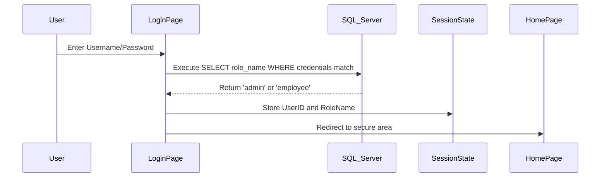
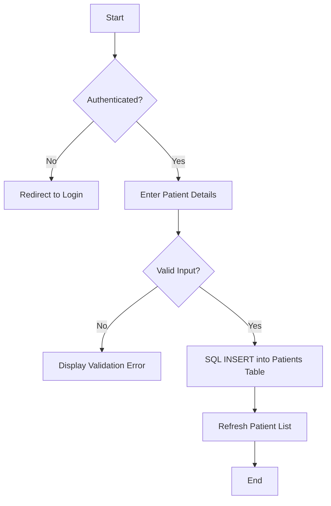
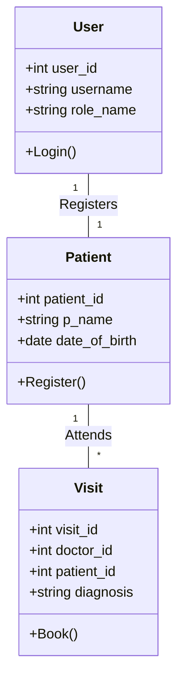

# Hospital Database Management System (HospitalDB)
## Comprehensive Project Documentation (Tasks 1-4)

---

### Task 1: Project Proposal

#### 1. Project Title
Hospital Database Management System (HospitalDB) - A Web-Based Healthcare Solution.

#### 2. Project Overview
The HospitalDB project is a data-driven web application designed to automate and streamline hospital operations. It provides a secure platform for staff to manage patient registrations and appointments while offering administrators a robust interface for user and system oversight. The application is built using the ASP.NET framework with VB.NET logic and a cloud-hosted MS SQL Server database.

#### 3. Core Objectives
- **Data-Driven Operations**: Utilize a central relational database to manage hospital resources, staff, and patients.
- **State Management**: Leverage Session-based tracking to maintain user context and security throughout the application.
- **Mandatory Validation**: Implement server-side and client-side validation to ensure 100% data integrity.
- **Data Security**: Secure all inputs using SQL Parameters (preventing SQL Injection) and enforce page-level authorization.
- **Role-Based Access Control (RBAC)**: Differentiate system capabilities between 'Admin' (Management) and 'Staff' (Operations) roles.

#### 4. Technology Stack
- **Frontend**: HTML5, CSS3, ASP.NET Web Forms.
- **Backend Logic**: VB.NET (ADO.NET).
- **Database**: MS SQL Server (Hosted on Somee.com).
- **Architecture**: 2-Tier Client-Server Architecture.

---

### Task 2: Software Requirements Specification (SRS)

#### 1. Functional Requirements
- **FR1: Secure Authentication**: Users must log in with valid credentials. The system must verify roles (Admin/Staff) to determine navigation options.
- **FR2: Patient Registration**: The system shall allow staff to register patients by capturing Name and Date of Birth into the `Patients` table.
- **FR3: Appointment Scheduling**: Staff shall book appointments by linking patients to available doctors in the `Visits` table.
- **FR4: User Administration**: Administrators shall have the ability to Create, Read, Update, and Delete (CRUD) system users in the `Users` table.
- **FR5: Department & Staff Viewing**: The system shall provide read-only views of hospital departments and medical staff for operational reference.

#### 2. Non-Functional Requirements
- **NFR1: Security**: All database queries must be parameterized. Unauthorized users must be redirected to the login page automatically.
- **NFR2: Performance**: Data retrieval for tables and grids must occur in under 2 seconds.
- **NFR3: Reliability**: The system must handle database connection timeouts and provide clear error labeling.
- **NFR4: Scalability**: The database schema must support the addition of new departments, staff, and equipment without structural changes.

---

### Task 3: Analysis and Design Model

#### 1. Use Case Model
```mermaid
useCaseDiagram
    actor Admin
    actor Staff
    
    Admin --> (Manage System Users)
    Admin --> (Edit User Roles)
    Staff --> (Register New Patient)
    Staff --> (Schedule Appointments)
    Staff --> (View Doctor Directory)
    (Manage System Users) ..> (Login) : include
    (Register New Patient) ..> (Login) : include
```

#### 2. Sequence Diagram (User Login & Role Assignment)


#### 3. Activity Diagram (Patient Registration Process)


#### 4. Class Diagram (Data Entities)


---

### Task 3A: Component and Deployment Model

#### 1. Component Model
- **Presentation Layer**: ASPX Web Forms (Login.aspx, pat_reg.aspx, Appointments.aspx).
- **Business Logic Layer**: VB.NET Code-behind (.aspx.vb) files handling event logic.
- **Data Access Layer**: ADO.NET `SqlConnection` and `SqlCommand` objects.
- **Database Layer**: MSSQL Relational Tables and Constraints.

#### 2. Deployment Model
- **Environment**: Hosted on Somee.com Cloud Platform.
- **Web Server**: IIS (Internet Information Services).
- **Database Server**: Dedicated MS SQL Server instance.
- **Network**: HTTPS protocol for secure data transmission.

---

### Task 4: Database Model

#### 1. ER Model (Entity-Relationship)
- **Entities**: Users, Employees, Patients, Visits, Departments, Designations.
- **Key Relationships**:
    - **Departments to Employees**: 1-to-Many (One department has multiple staff).
    - **Employees to Visits**: 1-to-Many (One doctor treats multiple visits).
    - **Patients to Visits**: 1-to-Many (One patient attends multiple visits).
    - **Users to Employees**: 1-to-1 Optional (A user account can be linked to an employee).

#### 2. Relational Model (Table Schema)
- `Users` (**user_id**, username, User_password, emp_id, role_name)
- `Patients` (**patient_id**, p_name, date_of_birth, registered_by)
- `Employees` (**emp_id**, dept_id, designation_id, emp_name, date_of_birth)
- `Visits` (**visit_id**, patient_id, doctor_id, visit_date, diagnosis)
- `Departments` (**dept_id**, dept_name, HOD_emp_id)

#### 3. Normalization of Relational Model
The database satisfies **3rd Normal Form (3NF)**:
- **1NF**: Every column contains atomic values, and every record is unique via a Primary Key.
- **2NF**: All non-key columns (like `p_name`) are fully dependent on the entire Primary Key (`patient_id`).
- **3NF**: No transitive dependencies exist. For example, job titles are stored in a separate `Designations` table rather than being repeated in the `Employees` table.

#### 4. Physical Model
- **Storage**: Optimized using `INT` for foreign keys and `VARCHAR` for flexible string storage.
- **Integrity**: Enforced via `FOREIGN KEY` constraints and `IDENTITY(1,1)` for auto-incrementing IDs.
- **Constraints**: `NOT NULL` constraints on essential fields and `CHECK` constraints on date fields (e.g., DOB must be in the past).

#### 5. SQL Implementation
The system is implemented using 11 relational tables. Sample DDL structure:
```sql
CREATE TABLE Patients (
    patient_id INT PRIMARY KEY IDENTITY(1,1),
    p_name VARCHAR(50) NOT NULL,
    date_of_birth DATE CHECK (date_of_birth < GETDATE()),
    registered_by INT FOREIGN KEY REFERENCES Employees(emp_id)
);
```
*The full implementation script is available in the `Improved_hospitalDB.sql` file.*
